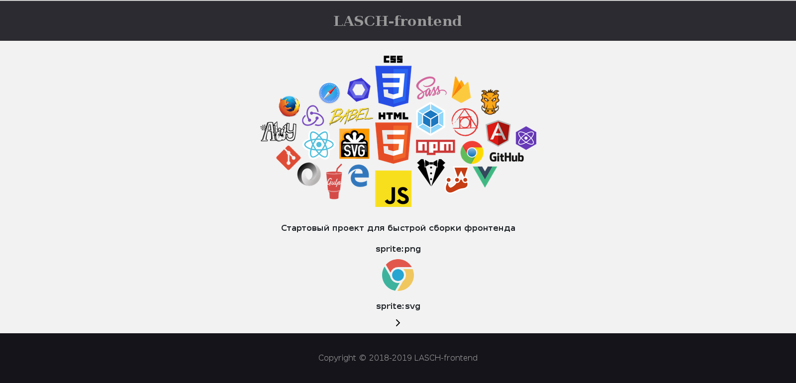

[](https://github.com/JackPot777/ "MIT License")

# **LASCH-frontend:** <br>Startup Project Template based on [Gulp 4](https://gulpjs.com/) & [Bootstrap 4](https://getbootstrap.com/)



Author: [LASCH agency](https://www.instagram.com/lasch_agency/ "Instagram page")

LASCH-frontend is all-inclusive start HTML5 template with **Bootstrap 4** (grid, reboot & utilities), **Gulp 4**, **Sass**, **Browsersync**, **Github pages**, **Autoprefixer**, **Clean-CSS**, **Uglify**, **Rsync** and **Bower** (libs path) support.

**LASCH-frontend** Start Project Template was created on the knee of curves projects. Now it works like a clock!

Cross-browser compatibility: IE9+.

Correct creation and output of png & svg sprites.

## How to use LASCH-frontend

:one: **LASCH-frontend** from GitHub - [`Download`](https://github.com/JackPot777/LASCH-frontend/archive/master.zip);

:two: Install Node Modules in root project folder: `npm i`;

:three: Run the template: `gulp`;

:four: For installing new jQuery library, just run the command `bower i plugin-name` in the terminal. Libraries are automatically placed in the folder `src/libs`. Bower must be installed in the system (`npm i -g bower`).

## Gulp tasks:

* **gulp**: run default gulp task (sass, js, watch, browserSync) for web development;
* **rsync**: project deployment on the server from :open_file_folder: **build** folder via **RSYNC**;
* **github**: project deployment on Github pages.

## Output of svg sprite:

HTML
```html
	<svg class="custom-class"><use xlink:href="img/sprite-svg.svg#id_sprite"></use></svg>
```

CSS
```css
	.custom-class {
		height: 14px;
		width: 14px;
	}
```

## Output of png sprite:

* The provided mixins are intended for use with variables.

SASS
```sass
	.icon-imagename
		@include sprite($image_name)
```

* ### How to use:

HTML
```html
	<i class="icon icon-chrome"></i>
```

CSS
```css
	.icon {
		display: inline-block;
	}
```

```css
	.icon-chrome {
		background-image: url(../img/sprite-png.png);
		background-position: 0px 0px;
		width: 64px;
		height: 64px;
	}
```
